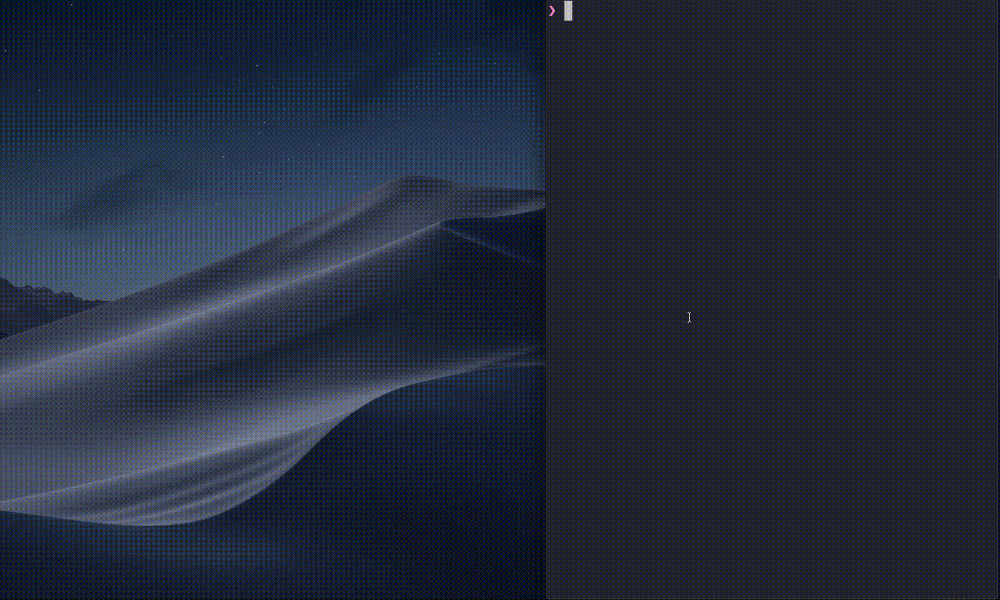

# Consider to use Gauge and Taiko, if:
- You want a reliable test, not a flaky test. Taiko has implicit waits that helps you to avoid this problem.
- You want a smart selector that you don't need to deal with CSS or XPath selector if you don't need it. With Taiko, you can select an element with a simple text/label, or Proximity e.g. above, below, new, etc. More about Proximity selectors https://docs.taiko.dev/api/reference/
- You want to use a powerful Taiko REPL that you can execute a command to a browser, repeat it easily and generate code from command history.




- You want to mock API easily.
- You want to write code with TypeScript. Taiko supports TypeScript.
- You want to involve a non-technical person to write a test specification. Gauge's test specification is written in Markdown with normal English sentences and easy to maintain.
- You want a simple way to extend and debug a test step. You can write Gauge's test step with TypeScript, Taiko and debug it with VS Code.
- Built-in report without additional setup

# Example of Gauge specification
- Content are written in Markdown

```
# Getting Started with Gauge

This is a context step that runs before every scenario
* Open todo application

## Display number of items
* Add task "first task"
* Must display "1 item left"
* Add task "second task"
* Must display "2 items left"
```

# Example of step implementation
- Step implementation is written in normal TypeScript
```ts
import { Step, Table, BeforeSuite, AfterSuite } from "gauge-ts";
import {
  below,
  checkBox,
  clear,
  click,
  closeBrowser,
  evaluate,
  goto,
  into,
  link,
  openBrowser,
  press,
  setConfig,
  text,
  textBox,
  toLeftOf,
  waitFor,
  write
} from 'taiko';
import * as assert from 'assert';

export default class StepImplementation {
  @BeforeSuite()
  public async beforeSuite() {
    console.log('before suite');
    await setConfig({ navigationTimeout: 60 * 1000 });
    await openBrowser({ headless: false });
  }

  @AfterSuite()
  public async afterSuite() {
    await closeBrowser();
  };

  @Step("Open todo application")
  public async openTodo() {
    await goto("todo.taiko.dev");
  }

  @Step("Add task <item>")
  public async addTask(item: string) {
    await write(item, into(textBox({
      class: "new-todo"
    })));
    await press('Enter');
  }

  @Step("Must display <message>")
  public async checkDisplay(message: string) {
    assert.ok(await text(message).exists(0, 0));
  }
}
```

# Learn more
- [Gauge documentation](https://docs.gauge.org/?os=linux&language=javascript&ide=vscode)
- [Taiko documentation](https://docs.taiko.dev/)
